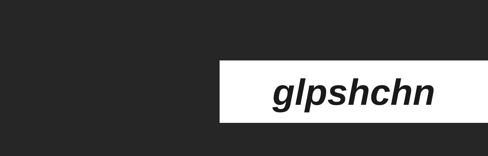

  

<h3 align="center">Привет! Меня зовут glpshchn</h3>

Backend-разработчик

  
  
  

---

## Обо мне

- Backend-разработчик, интересуюсь серверной архитектурой, API и базами данных
- Студент ИТМО, факультет ФИТиП, направление «Информационные системы», набор y28

## Стек

  
  
  
  

## Статистика GitHub

  

## Контакты

  

